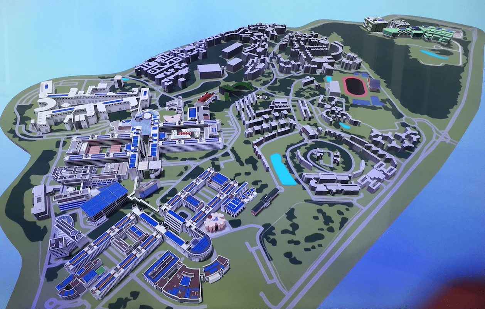
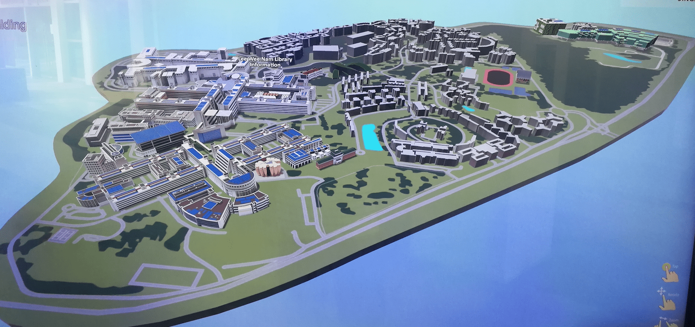
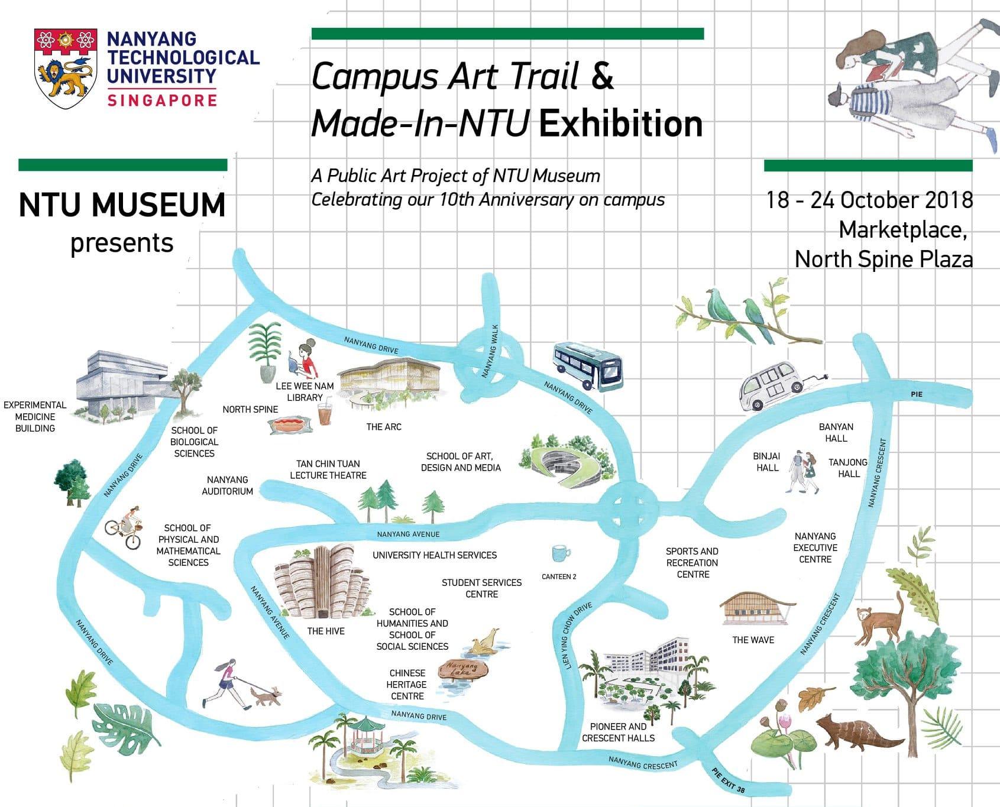
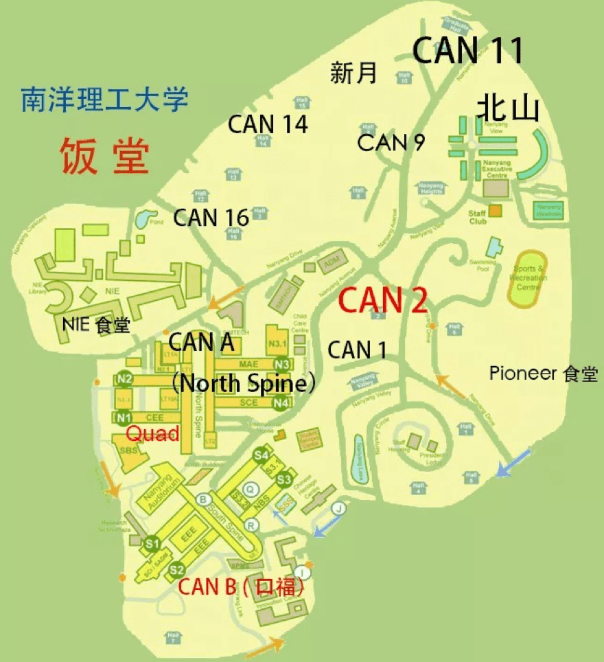

## NTU 校区

NTU校区大致是个平行西边形，东面是住宅区，教学区在西面。National Institute Education在西北角，NTU主要教学区则在西和西南，分别为North Spine和South Spine。两个Spine的中间是Nanyang Auditorium和Administration Building。每个Spine有4个block，block之间或周围也有一些教学楼。School of Physical and Mathematical Sciences在学校西南角，South Spine南面School of Art，Design and Media在校区中间。Student Service Centre在Block 3 & 4东面，是学校的最高点。

### NTU Campus Map:

- [NTU MAP PDF](http://www.ntu.edu.sg/odfm/usefulinfo/general/campusmap/Documents/NTUMap.pdf)
- [NTU Campus Map](http://maps.ntu.edu.sg/maps)
- 微信公众号: `南洋理工小助手`
- NTU 3D Map:
    
    

### NTU 景点

- [NTU景点打卡全攻略](https://mp.weixin.qq.com/s/NDtH9Lbm-02fD650CGbhaQ)
- NTU campus art trail:
    

## NTU 校区交通

- [NTU Transportation](http://www.ntu.edu.sg/has/Transportation/Pages/GettingAroundNTU.aspx)
- 微信公众号: 南洋理工小助手
- 微信小程序：NTU校车、新加坡公交

### Shuttle Bus Routes

- [Internal Shuttle Bus Service Map](https://baseride.com/maps/public/ntu)

#### Regular Bus Routes

- [Campus Loop-Blue (CL-B)](http://www.ntu.edu.sg/has/Transportation/Pages/CL-B.aspx)
- [Campus Loop-Red (CL-R)](http://www.ntu.edu.sg/has/Transportation/Pages/CL-R.aspx)
- [Campus Loop-Yellow (CL-Y)](http://www.ntu.edu.sg/has/Transportation/Pages/CL-Y.aspx)
- [Campus Rider (CR)](http://www.ntu.edu.sg/has/Transportation/Pages/CR.aspx)
- [Campus Weekend Rider (CWR)](http://www.ntu.edu.sg/has/Transportation/Pages/CWR.aspx)

#### [Express Bus Services](http://www.ntu.edu.sg/has/Transportation/Pages/GettingAroundNTU.aspx)

- Red Loop Express 1
- Red Loop Express 2
- Blue Loop Express 1
- CAMPUS RIDER

#### [Lunch Express Shuttle Bus Service](http://www.ntu.edu.sg/has/Transportation/Pages/Lunch-Express-Shuttle.aspx)

- Red Loop Lunch Express
- Blue Loop Lunch Express

#### [NTU-LKC Shuttle Buses](http://www.ntu.edu.sg/has/Transportation/Pages/NTU-LKC-ShuttleBuses.aspx)

- Free Shuttle Bus Service between NTU Yunnan and Novena Campuses

### 公交

- [179](https://busrouter.sg/#/services/179)
- [179A](https://busrouter.sg/#/services/179A)
- [199](https://busrouter.sg/#/services/199)

## NTU 食堂

- [NTU食堂简介](https://mp.weixin.qq.com/s/euMQlN9zJfBCE1CHLs2S0g)
    
- 推荐
    - `Quad`的拉面不错。
    - `Can 9`的Jiu Li Xiang炒菜不错。
    - `Can 9`的麻辣香锅按照重量计价，比较实惠。
    - `新月(Saraca)`的成都印象不错。
    - `Can 1`的麻辣香锅是按照件数计价，比较贵，不推荐。

## 编辑历史

- 2019-07-12： 初稿

