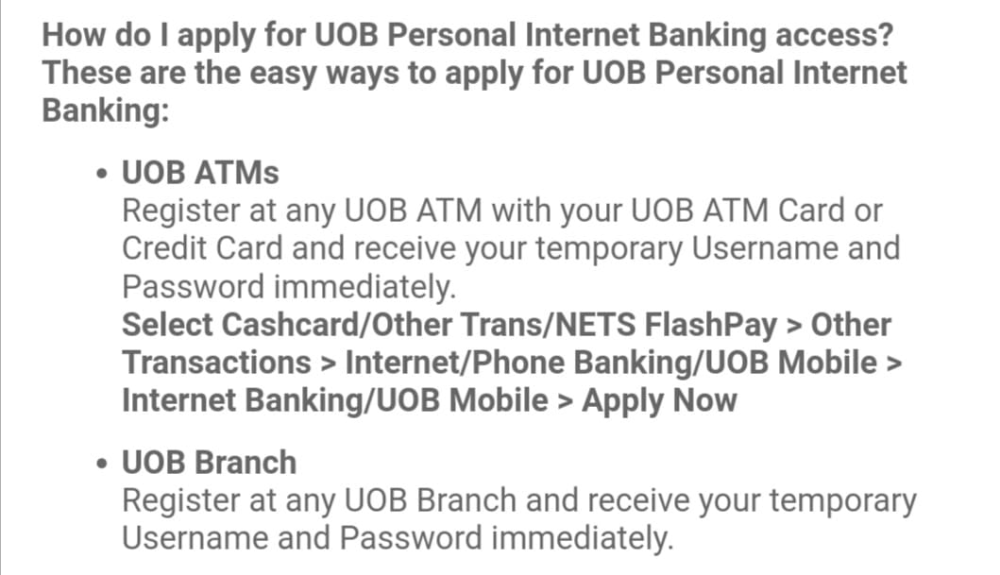
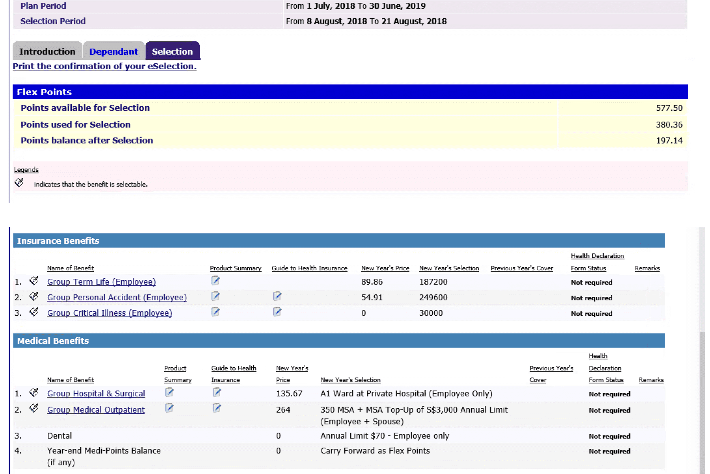
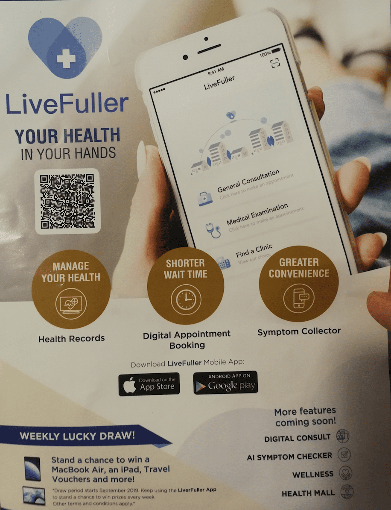
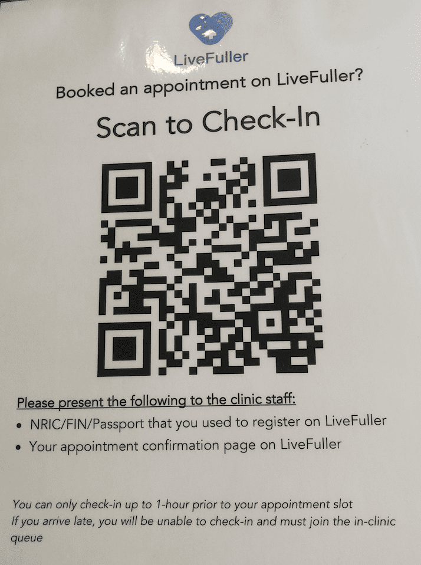

## 银行卡

### 银行账户和储蓄卡

学校会要求提供一个银行账号用于财务结算，如果第一月没有办理银行账户，工资会以支票的形式发放。学校里有OCBC(Oversea-Chinese Banking Corporation)和DBS的取款机，分别在North Spine和South Spine。OCBC在North Spine有个银行柜台，DBS的柜台在[JP(Jurong Point Shopping Centre)](https://goo.gl/maps/iCzbzntbhcazS9K4A)。不过办理银行账户，需要新加坡身份证，住址证明等材料。住址证明就是写有你具体住址的官网文件，比如水电费单，手机账单等。学校一般不会帮大家开住址证明，而大家刚到新加坡，也没有自己的房子，没有水电费单。如果没有办理手机业务，也没有手机账单，如果购买了Postpaid Card可能会有账单（有待考察）。一个确定可行的方式就是租房住址证明，可以问房东帮忙办理(貌似要在网站上登记一下，交点钱。不过貌似只适用于组屋。)，或者找楼管开学生宿舍证明。如果以上方式都不可行的话，还可以通过交租房的印花税(Stamp Duty)拿到，请参考[Stamp duty for proterty](../2020-05-20-stampduty/index.md)。最新消息：貌似在入职的时候，NTU人力资源部的工作人员会问你更新住址，给你打印一份印有MoM的证明，请参考[留新之前的准备: 入职报到](2020-05-22-singapore-preparation/index.md)。带着要求的文件到银行柜台开户就可以了，同时会有一张储蓄卡。

### 信用卡

如果有需要，还可以申请各大银行的信用卡，比如OCBC，DBS，UOB等。信用卡可以坐公共交通，食堂刷卡吃饭，出去消费等，据说UOB的One Card不错。

申请UOB的信用卡以后，需要开通的网银的话，请参考一下方式：
    

### 个人新加坡支付方式汇总

本人在新加坡有两张银行卡，DBS的储蓄卡和UOB的One Card信用卡，其中DBS储蓄卡绑定在我的DBS银行账户名下，本人在UOB并没有银行账号。DBS储蓄卡具有VISA，NETS，NETS@FlashPay，PLUS，EZ-Link，PayWave等功能，将这张银行卡绑定一下SimplyGo手机应用，并且到地铁站的充值机，将支付模式从CEPAS改成BANK模式就可以用来坐公交和地铁了。DBS的手机银行APP叫PayLah，平时用手机在各个食堂直接付款消费。UOB的One Card信用卡具有VISA和NETS功能，但是要使用NETS功能，需要开通UOB的账户，所以NETS功能，我实际上并不能使用。One Card可以直接用来坐公交和地铁，无需修改支付模式。此外，还可以从我的DBS账户往staff card里充值，用staff card消费。

目前我在新加坡的主要支付方式如下：

- Staff Card(目前基本只用于门禁)
    - 门禁
    - 食堂吃饭、麦当劳、学校超市购物
    - 公共交通

- DBS储蓄卡(目前基本只用于取现)
    - 取现
    - 食堂吃饭、麦当劳、学校超市购物
    - 公共交通
    - 网上支付、商场付费 (VISA)

- DBS Paylahs手机应用
    - 食堂吃饭、学校超市购物

- One Card
    - 公共交通
    - 个别食堂吃饭(信用卡VISA支付)、麦当劳、学校超市购物
    - 网上支付、商场付费 (VISA)

## FlexBen@NTU

NTU为faculty、staff和student提供了医疗保险，有关student的医保请参考[新加坡生活一站式启动 一 4. 新加坡生活信息汇总](../2020-05-22-singapore-info-collection/index.md) -> `NTU学生保险`。

Faculty和staff的医疗保险服务是[FlexBen@NTU](https://flexben.ntu.edu.sg/flexben)，我们可以选择购买哪些项目，多退少补，剩余的医保钱学校会在学年末(7月)退到工资卡里，请见下图选择示例。如果不做选择，学校会默认我们选择了最基本的医保。之后我们会收到AVIVA卡，用于看病。在选择FlexBen时候，还可以为家属选择部分医保。详情请查阅[FlexBen@NTU](https://flexben.ntu.edu.sg/flexben) -> `click the yellow figure`。

使用Mac登录FlexBen@NTU好像有问题，可以用Windows，Linux或者手机登录，选择医疗保险。

FlexBen选择示例:

看病时，带上自己的校园卡、Aviva卡和身份证。诊所(clinic)和医院(hospital)的信息可以查询[Health Care](http://www.ntu.edu.sg/CampusLife/Pages/HealthCare.aspx)、微信小程序`新加坡诊所`。这里以到[Fullerton Healthcare@NTU](http://www.ntu.edu.sg/has/Serv/Pages/MedicalClinic.aspx)为例，阐述基本的流程。Fullerton Healthcare@NTU位于[University Health Services Building](http://maps.ntu.edu.sg/maps#q:university%20health%20service%20building)。

- 医院窗口：Fullerton Healthcare@NTU前台有`registration`、`dental`、`dispensary`三个窗口。
- 就诊流程(每个人可能稍有区别)
    - 取号：到registration处，在取号机上输入手机号区号，等待被叫号。如果是第一次去，首先会被叫号后去registration柜台出示自己的身份证或者护照，进行注册登记。
    - 就医：取万号后等待被医生叫号看病。快到你的号时，会收到短信提醒。被医生叫号后，进入指定的Room就医。
    - 检查：如果医生判断需要做进一步检查，比如Xray、验血等，医生会开个单子，让你去做检查。开好检查单后，可能会被叫号去`dispensary`付钱和取药，再去检查。检查好以后，如果报告需要等很久才出，可以离开诊所，之后有问题，医生会电话联系你再去看。这里以验血为例子，讲讲检查的流程。
        - 首先到验血室，交给护士小姐姐验血单
        - 护士小姐姐会让你出示自己的Aviva卡、身份证或者护照，验明身份
        - 小姐姐会拿着你的单子和证件到电脑旁进行检查，会让你在诊室外等待
        - 过一会儿，你去拿回证件和单子，去`blood test`处排队抽血，如果没有人在你前面，直接敲门进去，喊小姐姐帮你抽血就行了。
- 现在可以通过手机在线在校医院预约医生，省略了取号和排队等待就医的时间，之前取完号，等待就医的时间可能要半天。
    - 手机下载`LiveFuller`应用程序，并注册账号，需要身份证号和手机号。
    

    - 选择`General Consultation`，预约就医时间。
    - 就医时，请携带好注册使用的证件以及LiveFuller里的预约确认页。
    

如果想买额外的保险，可以咨询新加坡的几家保险公司:

- [AIA](https://www.aia.com.sg/en/index.html)
- [Prudential](https://www.prudential.com.sg)
- [Great eastern](https://www.greateasternlife.com/sg/en/index.html)
- [Aviva](https://www.aviva.com.sg/en)
- [NTUC income](https://www.income.com.sg)
- [MSIG](https://www.msig.com.sg)

## 个人税务

在新加坡工作，需要自己每年主动报税。NTU的员工有`No-Filing Service (NFS)`，[Inland Revenue Authority of Singapore (IRAS)](https://www.iras.gov.sg)会自动计算的税单并通知我们，我们自己需要预览并确认这个账单是否正确。然后过一段时间正式账单会寄给我们，届时就可以交钱了。在入职以后，我们可以提前办理[SingPass](https://www.singpass.gov.sg)账户，用于登录IRAS系统，查看、修改个人信息和账单等。

### 办理SingPass账号

- 可以直接在SingPass[主页](https://www.singpass.gov.sg)申请办理SingPass账号，填完各种申请信息后，过几天会收到含有密码的信件，收件地址默认会是我们身份证上的地址。请参考[Instructional Guides](https://www.singpass.gov.sg/singpass/common/supportmain)。

    >**NOTE**:我们的身份证地址可能只写着Nanyang Technological University，各种政府的信件(比如Singpass网上注册密码信件，Inland Revenue Authority of Singapore(IRAS)税单等)不一定能及时找到我们的具体办公室地址，信件找不到收件人时会被标记为`GONE AWAY`，退回给寄信人，寄信人再查询收件人的具体地址后重寄信。兜兜转转好几天，也许还会寄不到。一个可能的解决方法是自己去更新一下，请参考Immigration & Checkpoints Authority (移民与关卡局)相关指导信息[Change of Residential Address for Identity Card](https://www.ica.gov.sg/documents/ic/update_residential_address)。由于我们并不是换地址，而是更新地址，所以不知道办理部门是否需要证明文件。

- 我们也可以去柜台办理SingPass账号，带上身份证分分钟就办好了，离NTU最近的柜台在[Gek Poh Ville Community Club](https://goo.gl/maps/GQA4V7U791DR1uUY8)，其他柜台信息请查询[Counter Locations](https://www.singpass.gov.sg/singpass/common/counter)。

更多信息请查看[SingPass FAQ](https://www.ifaq.gov.sg/SINGPASS/apps/Fcd_faqmain.aspx)。

### IRAS
登录IRAS[主页](https://www.iras.gov.sg)，点击`Login` -> `Login to myTax Portal` -> `Personal Tax`，通过SingPass账号登录IRAS系统。可以查看和修改个人信息、税单等。可以通过`Account` -> `Update Contact Details`修改Mailing Address、Email Address、手机号等。IRAS的信件会邮寄到更新后的地址，如果没有更新的话，会寄到身份证上的地址，出现上面提到的问题。

### 报税和缴税
NTU员工只需要确认IRAS帮我们计算的税单是否正确就可以了，不需要自己计算报税。确认之后过一段时间，会收到正式的账单和具体缴税方式。可以选择直接银行转账、GIRO等方式。

## 编辑历史

- 2019-07-12： 初稿
