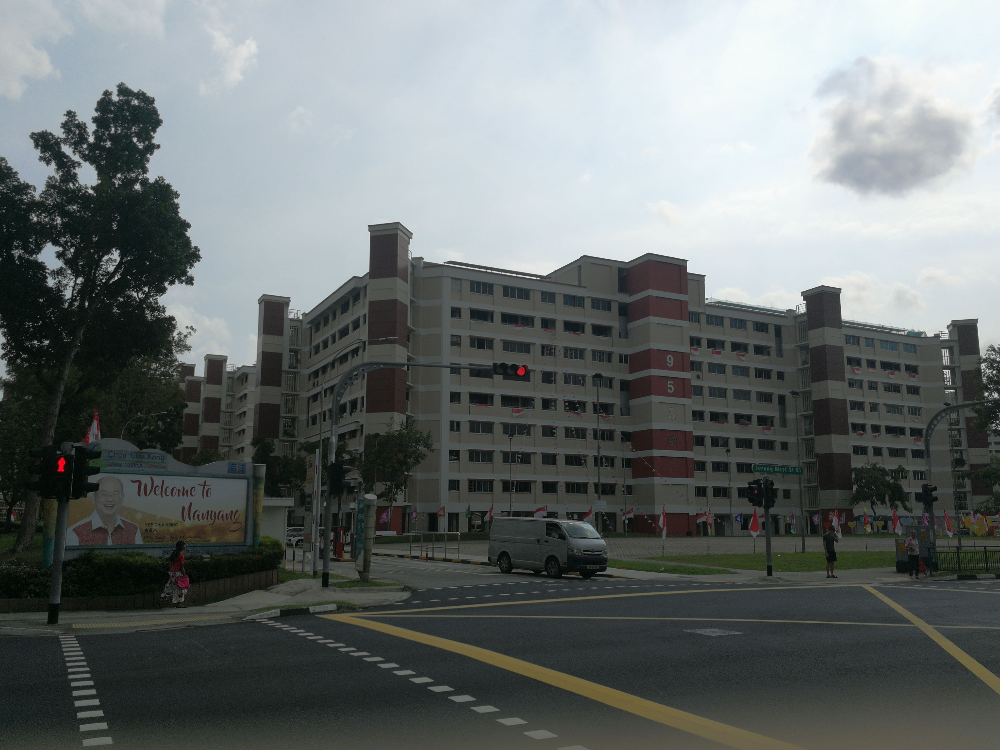
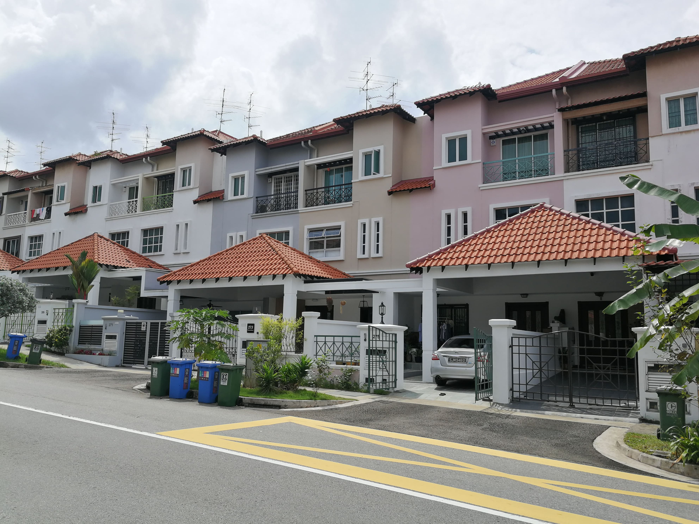
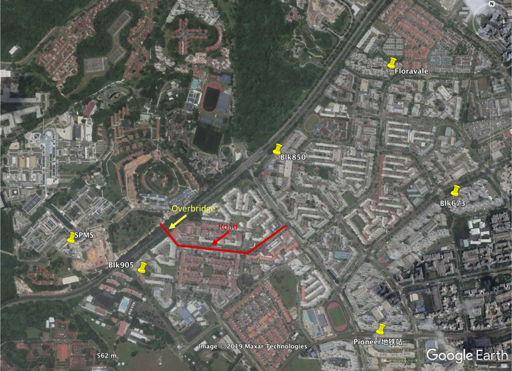
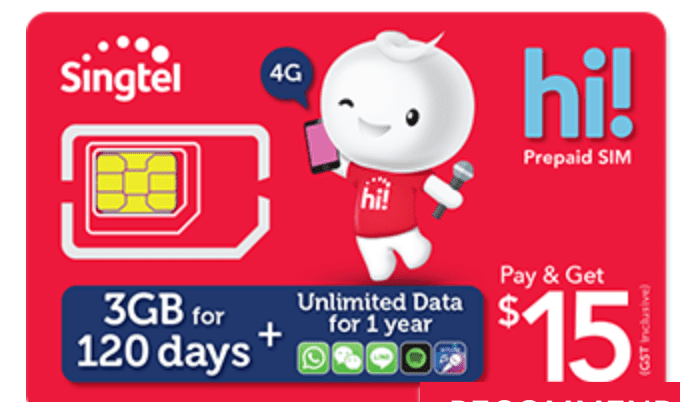

可以关注一下微信公众号以及小程序，了解在新加坡生活的需要有用信息。

- 新加坡眼: 很多新加坡生活信息
- 新加坡万事通：很多新加坡生活相关信息
- 新加坡便民：比较好的新加坡生活助手
- 南洋理工小助手：NTU相关信息

## 租房

### 简介

新加坡房屋大概有4类：

- 政府组屋(HDB)：大多数新加坡人住房，一般没有门卫、健身房、泳池等。
- 公寓(Condo)：一般都有门卫、健身房、泳池。
- 排屋(Terrace)：独门不独栋的联排别墅。
- 独栋别墅(Landed property)

组屋:

公寓:

排屋:

一般出租的都是组屋和公寓，房间分为主卧(Master Room)和普通房(Common Romm)。主卧一般有独立卫生间，普通房通常要和别人共用卫生间。新加坡存在大量的中国二房东赚取房间差价，租屋主和二房东的房间各有利弊，需要好好权衡，注意二房东在新加坡是违法的哦。可以尝试跟房东还价，试试看呗~

租房的时候一定要跟房东讲清楚各种事宜，如果能签合同是最保险的，这里有一份[合同模板](../singapore-economy/room-rental-agreement.docx)可以参考一下。如果需要合法文件证明你和房东之间的租赁关系，可以花钱办理`Certificate of Stamp Duty`，详情请参考[印花税](../singapore-economy/)。

以下注意事项可以参考:

- 水、电、汽、网、空调等是否包含在房租内。
- 是否可以做饭，一般租单间是不让做饭的。
- 洗衣机的使用情况。如果跟房东一块住的话，一周自己可以用几次洗衣机。
- 是否可以让家人、朋友偶尔来住。

NTU学生宿舍可以参考微信公众号`南洋理工小助手`

### 租房渠道

-  微信小程序: `小坡岛新加坡租房`
- 网站
    - [NTU Housing](https://www.ntu.edu.sg/has/housing/Pages/Housing.aspx)：适用于NTU的faculty和学生
    - [Off-Campus Housing](https://www.ntu.edu.sg/has/Off-Campus/Pages/index.aspx): 适用于NTU的学生
    - [PropertyGuru](https://www.propertyguru.com.sg): 新加坡本地发布平台，房源信息发布是最多的，信息筛选条件多。多为中介发布，有中介费。可下载app
    - [nestia](https://www.nestia.com): 新加坡本地发布平台，房源多，可以以某一建筑为中心从远及近的搜索房源。可下载app，自带的导航也不错。
    - [STProperty](https://www.stproperty.sg): 新加坡本地发布平台。
    - [狮城网](https://bbs.sgcn.com/forum.php?gid=1257)：多为华人房东。
    - [华新网](http://bbs.huasing.net/sForum/bbs.php?B=119,1)：多为华人房东。
    - [新加坡租房](https://www.sgroom.com)：不清楚。
- 中介
    - 找中介的话一定要找有执照的，本地大中介公司ERA, PropNex, Huttons, OrangeTee等。网上都可以查到Agent相关信息，确保自身利益。
- 短期租房
    - [85 soho](https://85soho.com): Student Hostel & Co-Living Space Apartment。

### MIGG成员租房信息统计
- A
    - 地址：The floravale
    - 费用：房租700新币/月，包水电汽网和空调。
    - 房子简介：公寓；4间卧室；房东一家三口住主卧和一间普通房，另两间普通房出租；与另一位租客共用卫生间；厨房不可用；洗衣机一周可用两次。
    - 信息来源：同学介绍。
- B
    - 地址：Block 905
    - 费用：房租370新币/月，水电汽网另算，最终约400多新币/月。
    - 房子简介：组屋；一间主人房，三间单间；租于二房东，二房东和一名租客住一个大单间，另外两间单间各住一名租客；与一位女生合住主人房，有独立卫生间；厨房可用；洗衣机可随便用(一般一周用两次左右)。
    - 信息来源：华新网
- C
    - 地址：Block 850
    - 费用：房租520新币/月，包水电汽网；若用空调，另加50新币。
    - 房子简介：组屋；三间卧室，一间书房；房东一家四口住主卧和书房，另两间普通房出租；与另一位租客共用卫生间；厨房不可用；洗衣机一周可用两次。
    - 信息来源：微信小程序`小坡岛新加坡租房`
- D
    - 地址：Block 673
    - 费用：房租650新币/月，包水电汽网和空调。
    - 房子简介：组屋；三间卧室；房东一家四口住主卧，另两间普通房出租；与另一位租客共用卫生间；厨房不可用；洗衣机一周可用两次。
    - 信息来源：微信小程序`小坡岛新加坡租房`

- [MIGG成员住址.kmz](MIGG-addr.kmz)，注意Pioneer地铁站是校车停靠站。
    
    > **注意**：NTU云南园隔条马路对面的HDB的编号基本是以9开头的，据说登革热发病率较高，准确性有待考证。如果能找到更合适的，暂时尽量不在这个区域找房源呗。

## 手机卡

 在新加坡生活居住，本地手机卡必不可少。可以购买[Singtel](https://www.singtel.com)的预付卡Prepaid Card，详情请查询[Singtel Prepaid Plans](https://www.singtel.com/personal/products-services/mobile/prepaid-plans)，NTU的Canteen 2附近的7-Eleven可以购买，15新币的`hi! SIM Cards`预付卡看来不错。以后可以下载Singtel的对应App: `hi!App`，购买喜欢的套餐以及手机充值，也可以利用微信公众号`新加坡便民`进行充值。当然也可以购买Postpaid Card，请参考[Singtel Postpaid Plan](https://www.singtel.com/personal/products-services/mobile/postpaid-plans)，可以去Jurong Point Shopping Centre (JP) 的[Singtel Exclusive Retailer](https://goo.gl/maps/z6wp6MbxbUHXw52KA)办理，对应的手机APP是MySingtel。如果先办理了Prepaid卡，也可以到Singtel营业厅或者他们在JP等地方的RoadShow转成Postpaid卡，后者的好处是流量多，但是有合约，一年一年签。我在新加坡用了一年的Prepaid卡，后来转成了Postpaid卡，一个月20新币费用，包含20G流量，150min本地通话，500条SMS。

## 公共交通

乘坐公共交通工具，比坐bus和MRT，有很多种付款方式。一般坐bus的时候，前门上车刷卡，后门下车刷卡。上车时默认收取全程车费，所以下车时切忌刷卡，保证自己不被多收钱。新加坡公交不报站，需要自己到站前按铃提醒司机。车费支付方式：

- 校园卡
    - 我们的校园卡具有很多支付功能，如NETS@FlashPay，公共交通支付等，所以我们可以用校园卡乘车。校园卡也可以在支持NETS@FlashPay的商店付款，基本上学校内的食堂和超市都是支持NETS@FlashPay的。
    - 充值方法
        - 在每个地铁站里有充值器 General Ticketing Machine (GTM)，可以用现金、银行卡直接充值，无手续费。
        - SPMS正门的二楼电梯旁边的墙壁上也有一台红色的充值机。
        - 在7-Eleven便利店充值，每次收取0.5新币的手续费。Canteen 2附近有一家7—Eleven。
        - 利用手机APP，比如FlashPay，从自己的银行卡里直接充值，不过单次操作最多充值50新币，且每次有0.25新币的手续费。
- 储蓄卡
    -  下载APP：TL SimplyGo，绑定银行卡。如果银行卡本身具有EZ-Link或NETS@FlashPay的功能，需要到地铁站的充值机General Ticketing Machine (GTM)，转换付款模式(payment mode)为contactless payment (BANK MODE)。把卡放在读卡器上，按照指示，转变付款模式就可以了。现在，就可以直接刷银行卡坐车了。
- 信用卡
    - 可以直接用支持公共交通支付的信用卡进行支付，比如UOB的One Card等。可能有的信用卡需要在TL SimplyGo注册一下才行。
- 手机支付
    - Apple Pay
    - Singtel Dash
    - 其他方式：欢迎告知

## 编辑历史

- 2019-07-12： 初稿
